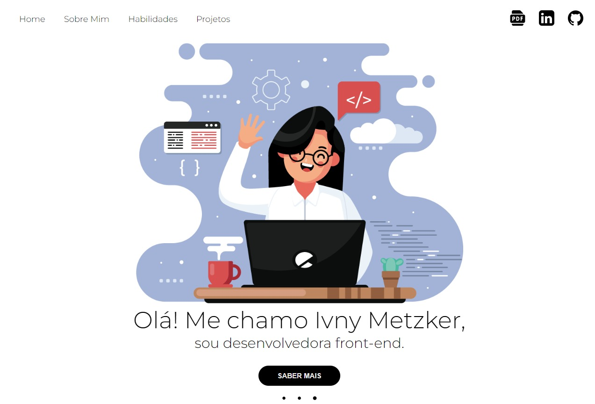

# Portifólio

## 🛠 Andamento
WIP - Work In Progress

## 🛸 Tecnologias Utilizadas

- HTML 5
- CSS 3
- JAVA SCRIPT

## 🖥️ Demonstração

## 🔗 Link da Página

<a href="https://portifolio-ivnymetzker.netlify.app/" rel="Site" target="_blank">Clique aqui para ir para o projeto em execução</a>

## 👾 Créditos

Desenvolvido por: <a href="https://github.com/iMetzker">Ivny Metzker</a>  
Designer Gráfico: <a href="https://www.instagram.com/cristiano_leh/">Cristiano Lehmann</a>

